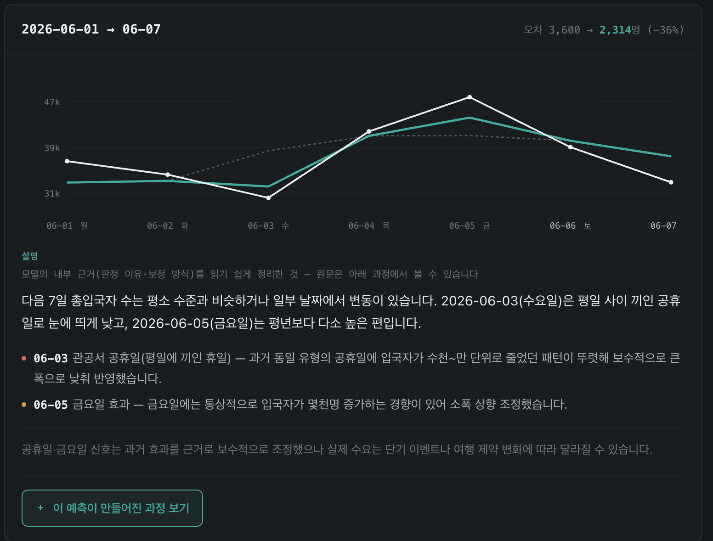
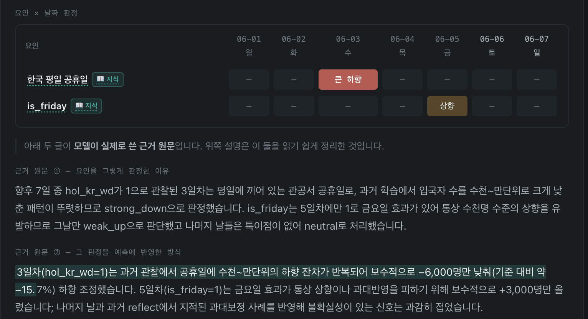

# TSFM + LLM 공변량 보정

일별 방한 외국인 입국자 수를 7일 예측한다. 시계열 파운데이션 모델(Chronos-2)이 타깃 과거값만으로
기준 예측을 만들고, LLM이 공휴일·콘서트·환율 같은 공변량이 그 예측을 어느 방향으로 얼마나 밀어야
하는지를 날짜별로 진단해 보정한다.

홀드아웃 6주에서 MAE 4397에서 3706으로 15.7% 줄었고 6/6 window가 개선됐다.
전체 실험 결과와 ablation은 [RESULTS.md](RESULTS.md)에 있다.



6월 1~7일 예측이다. 흰 선이 실제, 청록 선이 보정 예측, 점선이 공변량을 보지 않는 기준선이다.
6/3 공휴일의 급락과 6/5 금요일의 반등을 기준선은 놓치고 보정 예측은 따라간다(오차 3,600 → 2,314).
리포트 전문은 `analysis/fs_report_sig2.html`이며 단일 HTML이라 브라우저로 바로 열린다.


## 어떻게 작동하나

한 window(7일)에 도는 순서.

| 단계 | 하는 일 |
|---|---|
| B-1 base | `Ŷ_base = Chronos-2(타깃 과거 28일)`. 공변량은 보지 않는다 |
| B-2a attribution | 과거 사례를 시계열 모양(DTW)으로 검색해 채널별 5단계 라벨 + 근거 생성 |
| B-2b calibration | 이번 라벨로 사례를 다시 검색해 `Ŷ_calib` 7일치 + 근거 생성 |
| B-3 reflection | 실제와 대조해 어느 라벨이 틀렸는지 회고 |
| B-4 update | case를 메모리에 append |

라벨은 `strong_down | weak_down | neutral | weak_up | strong_up` 5단계다. 공휴일·항공편처럼 미래 값을
아는 채널(11개)은 7일 각각에, 환율·기상처럼 모르는 채널(12개)은 window당 하나만 매긴다.



판정은 요인 하나를 주 단위로 뭉뚱그리지 않는다. 공휴일은 그날 하루만 `strong_down`,
금요일은 해당 요일만 `weak_up`으로 잡히고 나머지 날은 건드리지 않는다.


## 돌리는 법

```bash
pip install -r requirements.txt
cp .env.example .env          # OPENAI_API_KEY 입력

python run.py                 # 전체 파이프라인 (기본: sig2 + ±20%)
```

`run.py`가 5단계를 순서대로 돈다.

```
[1/5] dataset     master_daily.parquet 있으면 skip
[2/5] knowledge   채널별 지식 생성 (memory/knowledge.json 있으면 재사용)
[3/5] experience  train 18 window B 루프 → memory/run_sig2/experience.json
[4/5] evaluate    test 6 window 추론 + 채점 → memory/run_sig2/test_results_*.json
[5/5] report      analysis/fs_report_sig2.html (LLM 없음)
```

| 인자 | 기본 | 설명 |
|---|---|---|
| `--channels` | `sig2` | `all`(23) / `sig4` / `sig2` 또는 쉼표구분 채널명 |
| `--scale-pct` | `20` | 보정 크기 상한 ±N%; `0`이면 제한 없음 |
| `--knowledge` | `knowledge.json` | 읽을 knowledge 파일명 |
| `--regen-knowledge` | 꺼짐 | knowledge부터 새로 생성 |
| `--out` | `analysis/fs_report_<tag>.html` | 리포트 출력 경로 |

### Ablation

`run.py`에는 없고 각 스크립트에 붙어 있다. `--no-knowledge`는 `experience.py`와 `evaluate.py`,
`--no-reflection`은 `experience.py`, `--no-experience`는 `evaluate.py`가 받는다.
`--model` / `--effort`(기본 `gpt-5-mini` / `low`)는 세 스크립트가 각각 받는다.

```bash
python experience.py --channels sig2 --exp memory/abl/experience.json --no-reflection
python evaluate.py   --channels sig2 --exp memory/abl/experience.json --no-experience
```

## 데이터

`dataset/master_daily.parquet`. 198일(2025-11-29 ~ 2026-06-14), 타깃 1 + 공변량 23채널이다.
lookback 28일 / 예측 7일 / window 간격 7일로 train 18 + test 6이며 서로 겹치지 않는다.
원본 xlsx에서 재구축하려면 `python dataset/build_dataset.py`.

## 분석 도구

리포트 외에 개발자용 화면도 존재한다.

```bash
python analysis/explain_page.py --res <test_results.json> --exp <experience.json> \
       --out analysis/fs_explain.html --standalone     # window별 궤적·라벨·검색된 사례
python analysis/weekday_mae.py <test_results.json>     # 요일별 MAE
```

두 스크립트 모두 `--exp`에 주는 파일 이름이 `experience*.json`이어야 한다. 옆의
`train_analysis*.json`을 이름 치환으로 찾기 때문이다(`run.py`로 돌리면 항상 맞는다).