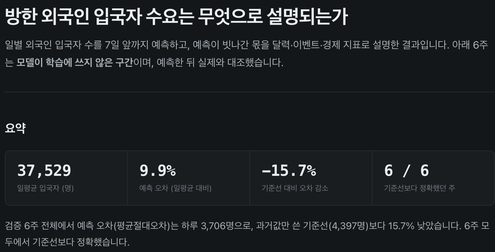
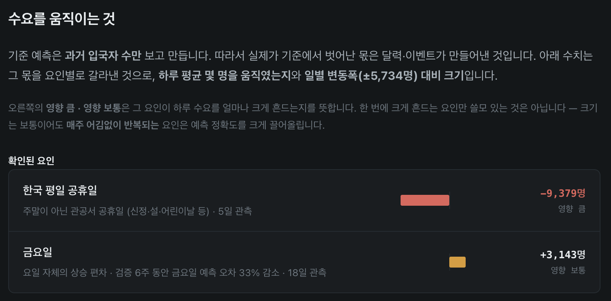

# 결과

test 6 window(2026-05-04 ~ 06-14) 기준이다. base는 어느 조합에서나 4397로 같다(TSFM은 결정적).
파이프라인 설명은 [README.md](README.md)에 있다.

## 채널 × 보정 상한

채널 2종과 보정 상한 3종을 모두 교차해 돌렸다.

| 채널 | 상한 | calib | 차이 | win | 리포트 |
|---|---|---|---|---|---|
| **sig2 (2채널)** | **±20%** | **3706** | **−690 (−15.7%)** | **6/6** | `analysis/fs_report_sig2.html` |
| sig2 | 제한 없음 | 3749 | −648 (−14.7%) | 6/6 | |
| sig2 | ±5% | 3849 | −548 (−12.5%) | 6/6 | |
| **all (23채널)** | **±5%** | **4266** | **−131 (−3.0%)** | **4/6** | `analysis/fs_report_all.html` |
| all | ±20% | 4916 | +519 (+11.8%) | 2/6 | |
| all | 제한 없음 | 5185 | +789 (+17.9%) | 2/6 | |

굵은 두 행은 리포트와 산출물이 저장소에 들어 있다. 각 칸은 1회 실행분이고, sig2/±20%는 리포트가
붙은 재실행분(3706)을 실었다. 같은 설정의 앞선 실행은 3690이었다.

채널 수와 보정 상한은 같이 움직인다. 신호가 확실한 2채널은 ±20%까지 밀 때 가장 좋지만,
23채널 전체는 같은 폭으로 밀면 base보다 나빠진다(+11.8%). 채널을 늘릴수록 상한을 조여야 겨우 손해를
면하는 셈이다. 잡음 채널이 보정 방향을 흐트러뜨린다는 뜻으로 보인다.

`sig2`는 잔차에 대한 효과크기(Cohen's d ≥ 0.5)로 고른 `hol_kr_wd`, `is_friday` 두 채널이다.
요일별로 보면 금 −33.3%, 수 −25.7%, 월·화 −16%대이고 목·토·일은 0%다. 신호가 없는 날은
건드리지 않는다.

## Ablation

구성요소를 하나씩 빼고 같은 조건(±5%)으로 돌렸다. `--no-knowledge`는 채널별 사전 지식을
프롬프트에서 빼고 그날 값만으로 판정하게 하고, `--no-reflection`은 B-3을 건너뛰어 라벨 교정 없이
원본 라벨만 저장한다.

| 채널 | 전체 | `--no-knowledge` | `--no-reflection` |
|---|---|---|---|
| sig2 | 3849 (6/6) | 4299 (+450, 5/6) | 3904 (+55, 6/6) |
| all | 4266 (4/6) | 4537 (+271, 1/6) | 4165 (−101, 3/6) |

knowledge를 빼면 둘 다 나빠진다. 특히 all에서는 win이 4/6에서 1/6으로 떨어져, 채널이 많을수록
사전 지식에 더 기댄다는 것을 보여준다. reflection은 sig2에서만 기여하고 all에서는 없는 편이 낫다.

산출물은 각각 `memory/run_sig2/`, `memory/run_all/`에 있다. 리포트는 단일 HTML이라 브라우저로
바로 열린다.

## 한계

- test가 6 window(6주)라 표본이 작다. 계절성이 다른 구간에서의 검증이 필요하다.
- 각 설정이 1회 실행분이고 LLM 호출의 반복 실행 분산은 아직 재지 않았다. 같은 설정에서 3690과
  3706이 나온 것을 보면 수십 단위의 흔들림은 있다.
- 채널 선별이 잔차 기반 효과크기에 의존하므로 데이터가 늘면 `sig2` 구성이 바뀔 수 있다.